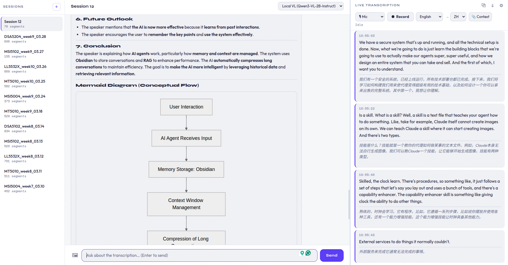

# Qwen3-ASR Transcription Server

Local speech-to-text service powered by [Qwen3-ASR](https://github.com/QwenLM/Qwen3-ASR), with a FastAPI backend and clients for files, microphone, and video.



## Features

- **File transcription** — MP3/WAV/M4A/video audio → timestamped TXT
- **Vocal extraction** — isolates human voice from background music before ASR (via [demucs](https://github.com/facebookresearch/demucs))
- **VAD segmentation** — WebRTC VAD splits audio into speech segments
- **Vocabulary context** — feed a PDF or Markdown document to improve domain-specific terminology
- **Streaming** — real-time transcription over WebSocket; audio sent as captured, partial results shown immediately
- **Prefix caching** — vLLM APC reuses KV-cache for the shared context/system-prompt prefix across utterances
- **Forced alignment** — word-level timestamps via Qwen3-ForcedAligner
- **Microphone input** — live transcription from system mic
- **Web UI** — instructor interface with session management, live mic transcription, AI chat, segment translation, and export
- **Viewer page** — read-only live view for students; receives real-time transcription, partials, and translations via SSE; includes AI chat using the instructor's API keys
- **Pop-out window** — ⧉ button opens a floating transcription-only viewer that can be pinned on top via the OS window manager
- **Mermaid diagrams** — AI responses with diagram syntax are rendered as SVG (both fenced blocks and bare VL output)
- **Qwen-VL** — optional vision-language model (`--qwenvl`) for image-aware chat and per-segment auto-translation

## Models

| Model | Size | Purpose |
|---|---|---|
| `Qwen3-ASR-1.7B` | ~3.5 GB | Speech recognition |
| `Qwen3-ForcedAligner-0.6B` | ~1.2 GB | Word-level timestamps |
| `Qwen3-VL-2B-Instruct` *(optional)* | ~5 GB | Vision-language chat + translation |

ASR and aligner are loaded from local directories at startup. ASR inference is handled by [`qwen_asr_inference`](https://github.com/QwenLM/Qwen3-ASR). The VL model runs as a separate vLLM OpenAI-compatible subprocess on `VL_PORT` (default 9004).

## Setup

```bash
pip install -r requirements.txt
```

## Usage

### 1. Start the ASR server

```bash
CUDA_VISIBLE_DEVICES=0 python server.py
CUDA_VISIBLE_DEVICES=0 python server.py --port 9000                             # custom port
CUDA_VISIBLE_DEVICES=0 python server.py --qwenvl                                # + Qwen3-VL-2B-Instruct
CUDA_VISIBLE_DEVICES=0 python server.py --qwenvl Qwen/Qwen2.5-VL-7B-Instruct   # custom VL model
CUDA_VISIBLE_DEVICES=0,1 python server.py --qwenvl --vl-device 1                # VL on GPU 1, ASR on GPU 0
CUDA_VISIBLE_DEVICES=0,1 python server.py --asr-device 0 --qwenvl --vl-device 1 # explicit GPU assignment
```

Poll `GET /health` until `"status": "ready"` before sending requests.

**Key env vars:**

| Variable | Default | Description |
|---|---|---|
| `ASR_MODEL_NAME` | `Qwen3-ASR-1.7B` | Local path or HF model ID |
| `ALIGNER_MODEL_NAME` | `Qwen3-ForcedAligner-0.6B` | |
| `GPU_MEMORY_UTILIZATION` | auto | vLLM GPU fraction for ASR model; auto targets ~6 GB |
| `VL_GPU_MEMORY_UTILIZATION` | auto | vLLM GPU fraction for VL model; auto uses free GPU after ASR + aligner (capped at 20 GB) |
| `VL_MAX_MODEL_LEN` | auto | VL context length; auto-sized from free GPU (max 16384) |
| `VL_PORT` | `9004` | Internal port for VL subprocess |
| `ASR_PORT` | `9002` | Default port; overridden by `--port` CLI arg |
| `ASR_DEVICE` | `""` | GPU index for ASR model (overridden by `--asr-device`) |
| `VL_DEVICE` | `""` | GPU index for VL subprocess (overridden by `--vl-device`); empty = share GPU with ASR |
| `ENABLE_ASR_MODEL` | `true` | |
| `ENABLE_ALIGNER_MODEL` | `false` | Set `true` to enable word-level timestamps |
| `ENABLE_PREFIX_CACHING` | `true` | vLLM APC — caches context prefix KV blocks across utterances |

### 2. Transcribe a file

```bash
python client_file.py audio.mp3 --language English
```

For event recordings with background music, add `--vocal-extraction` to run demucs first:

```bash
python client_file.py event_recording.mp3 --vocal-extraction --context slides.md --language English
```

Timestamps can be offset (e.g. recordings starting mid-event):

```bash
python client_file.py event_recording.mp3 --offset 1:30:00   # hh:mm:ss
python client_file.py event_recording.mp3 --offset 18:00     # hh:mm
python client_file.py event_recording.mp3 --offset 18        # hh (hours)
```

Output: `<stem>.txt` — one line per speech segment:

```
[0:01:23] So clustering is an unsupervised learning task.
```

**How it works internally:**

```
input audio
  → [demucs htdemucs]        only with --vocal-extraction
  → resample to 16kHz mono
  → WebRTC VAD (level 2)     split into speech segments
  → stream over WebSocket    with optional vocabulary context
  → <stem>.txt
```

> **When to use `--vocal-extraction`:** event recordings (conferences, meetups) with background music and PA noise. Without it the ASR model hallucinates repetitive generic phrases when fed music. For clean lecture/interview audio it is unnecessary overhead (adds several minutes of CPU time). Separated tracks are cached in `separated/` next to the audio file and reused on subsequent runs.

### 3. Live microphone transcription

```bash
python client_mic.py                       # English, localhost:9002
python client_mic.py -l zh                 # Chinese
python client_mic.py -l English            # full name also works
python client_mic.py -v                    # verbose VAD debug output
python client_mic.py -e ws://host:9002/transcribe-streaming  # remote server
```

Speak into the mic; each detected utterance is transcribed and printed with a timestamp. Press `Ctrl+C` to stop.

**Tunable VAD constants** (top of `client_mic.py`):

| Constant | Default | Effect |
|---|---|---|
| `VAD_AGGRESSIVENESS` | `3` | 0–3; higher = stricter speech detection |
| `SILENCE_END_FRAMES` | `~33` | frames of silence to end an utterance (~1 s) |
| `ENERGY_THRESHOLD` | `0.018` | RMS floor; raise to suppress background noise |

If stuck on `[Recording...]`, background noise is triggering speech detection — increase `VAD_AGGRESSIVENESS` or `ENERGY_THRESHOLD`.

**Client file options** (`client_file.py`):

| Option | Default | Effect |
|---|---|---|
| `--offset` | `0:00:00` | Add time offset to all timestamps. Format: `hh:mm:ss`, `hh:mm`, or `hh` (e.g. `18:00` = 18 h, `1:30:00` = 1.5 h) |
| `--output` | `<stem>.txt` | Custom output file path |

### 4. Transcribe a video file

```bash
python process_video.py lecture.mp4 --text-out transcription.json
```

Extracts audio via ffmpeg, starts the server, transcribes, saves JSON.

### 5. Web UI

Start the web UI server alongside the ASR server:

```bash
# Set at least one AI provider API key
ANTHROPIC_API_KEY=sk-...  python web_server.py   # Claude
GOOGLE_API_KEY=...         python web_server.py   # Gemini
MISTRAL_API_KEY=...        python web_server.py   # Mistral
```

Optionally override server ports via CLI args:

```bash
# Connect to remote ASR server
python web_server.py --asr-host 192.168.1.100 --asr-port 9003

# Run on custom ports
python web_server.py --port 8002
```

Then open `http://localhost:8001` (or custom port) in a browser.

**Instructor page** (`/`) — three-panel layout:
- **Left** — session list, auto-saved to `localStorage`; double-click to rename, ✕ to delete
- **Middle** — AI chat about the current session's transcription; supports image attachment (🖼) when using Local VL
- **Right** — live mic transcription with VAD; language selector; auto-translation target selector (shown next to language when VL is available); PDF/MD/TXT context upload (📎); export (⇩)

The left/right panel boundary is a draggable divider; width is saved to `localStorage`.

**Audio source**: toggle between 🎙 Mic (echo/noise cancellation on) and 🔊 Speaker/Line-in (all processing off). Speaker mode uses a shorter max-utterance window (~18 s force-flush) suited for recording desktop audio.

**Auto-translation**: when a target language different from the source is selected, each new transcription segment is automatically translated after it arrives. The `⇄ Translate` / `✕ Delete` buttons appear at the bottom-right of each entry on hover. Translations are broadcast to viewers.

**Image chat**: select `Local VL` in the model dropdown, attach an image (🖼), and ask a question. The image thumbnail is shown in the chat history and can be clicked to enlarge.

**Mermaid diagrams**: AI responses containing Mermaid diagrams are rendered as SVG. Both fenced ` ```mermaid ``` ` blocks and bare diagram syntax output by VL models (e.g. `graph TD`, `flowchart`, `sequenceDiagram`) are supported.

**Pop-out transcription window**: click ⧉ in the transcription panel header to open a floating 400×620 px viewer window. It receives live updates via SSE and can be pinned always-on-top using the OS window manager — useful for monitoring transcription while working in another app.

**Settings** (⚙): collapsible panel in the transcription header to configure ASR server host/port. Settings are saved to `localStorage` and synced to `web_server.py` via `POST /api/config`.

> **Microphone** requires a secure context. Access via `http://localhost:8001`, not an IP address over HTTP. For remote access, use HTTPS (self-signed cert with `openssl req -x509 ...`).

**Remote access via SSH tunnel** (single port, no VL port needed):

```bash
ssh -p <port> -L 9002:localhost:9002 user@remote-host
```

All VL traffic is proxied through the main server (`/vl/proxy/...`), so only one tunnel is needed.

### 6. Viewer page (live lecture feed)

Students open `http://[your-ip]:8001/viewer` on the same network.

- **Left** — AI chat (uses the instructor's API keys; students need no accounts; viewers can also set their own API keys via the ⚙ settings panel, stored in `localStorage` only)
- **Right** — live transcription updated in real-time via SSE, including partial text and translations; ⇄ Trans button toggles translation visibility; ⇩ export downloads TXT

The instructor's page automatically pushes each new segment (with translation if enabled) to `web_server.py`, which relays them to all connected viewers. Session state is held in memory — restarting `web_server.py` clears it; viewers reconnect automatically.

#### Same-network access (simple)

Students browse to `http://[instructor-local-ip]:8001/viewer`. Find your local IP with `ip route get 1` or `hostname -I`.

> Many public/university WiFi networks enable **AP isolation**, which blocks device-to-device traffic. If students can't reach the page, use the SSH tunnel approach below.

#### Remote access via SSH reverse tunnel (recommended for classroom WiFi)

```bash
ssh -R 0.0.0.0:8001:localhost:8001 -i ~/.ssh/your-key.pem ubuntu@<relay-server-ip>
```

Students open `http://<relay-server-ip>:8001/viewer`. For a resilient tunnel that auto-reconnects:

```bash
autossh -M 0 -o "ServerAliveInterval 30" -o "ServerAliveCountMax 3" \
  -o "ExitOnForwardFailure=yes" \
  -R 0.0.0.0:8001:localhost:8001 -i ~/.ssh/your-key.pem ubuntu@<relay-server-ip> -N
```

**One-time relay server setup** (AWS EC2 or any VPS):

```bash
sudo ufw allow 8001
echo 'GatewayPorts clientspecified' | sudo tee -a /etc/ssh/sshd_config
sudo systemctl restart ssh
```

For AWS EC2: also open port 8001 in the instance's **Security Group inbound rules**.

## HTTP API

### `POST /transcribe`

```bash
curl -F "files=@audio.wav" "http://localhost:9002/transcribe?language=English"
curl -F "files=@audio.wav" "http://localhost:9002/transcribe?language=English&forced_alignment=true"
```

### `WS /transcribe-streaming`

```
→ {"type": "start", "format": "pcm_s16le", "sample_rate_hz": 16000, "context": "...optional..."}
→ <binary PCM int16 mono 16kHz frames>
→ {"type": "stop"}
← {"type": "partial", "text": "...", "language": "English"}
← {"type": "final",   "text": "...", "language": "English"}
```

### `GET /health`

```json
{
  "status": "ready",
  "limits": {"max_concurrent_decode": 4, "max_concurrent_infer": 1},
  "memory": {"ram_total_mb": N, "ram_available_mb": N, "gpu_allocated_mb": N, "gpu_reserved_mb": N}
}
```

### `GET /vl/health`

Returns VL server status: `{"enabled": true, "model": "Qwen/Qwen3-VL-2B-Instruct", "port": 9004}`.

### `POST /vl/proxy/{path}`

Proxies requests to the internal VL server. Used by `web_server.py` so clients only need one open port.

## Supported Languages

English, Chinese, Cantonese, Japanese, Korean, Arabic, German, French, Spanish, Portuguese, Indonesian, Italian, Russian, Thai, Vietnamese, Turkish, Hindi, Malay, Dutch, Swedish, Danish, Finnish, Polish, Persian, Greek, Romanian, Hungarian, Macedonian.

Pass the **full name** (e.g. `--language Chinese`) for `client_file.py`. Both short codes and full names work for `client_mic.py`.
